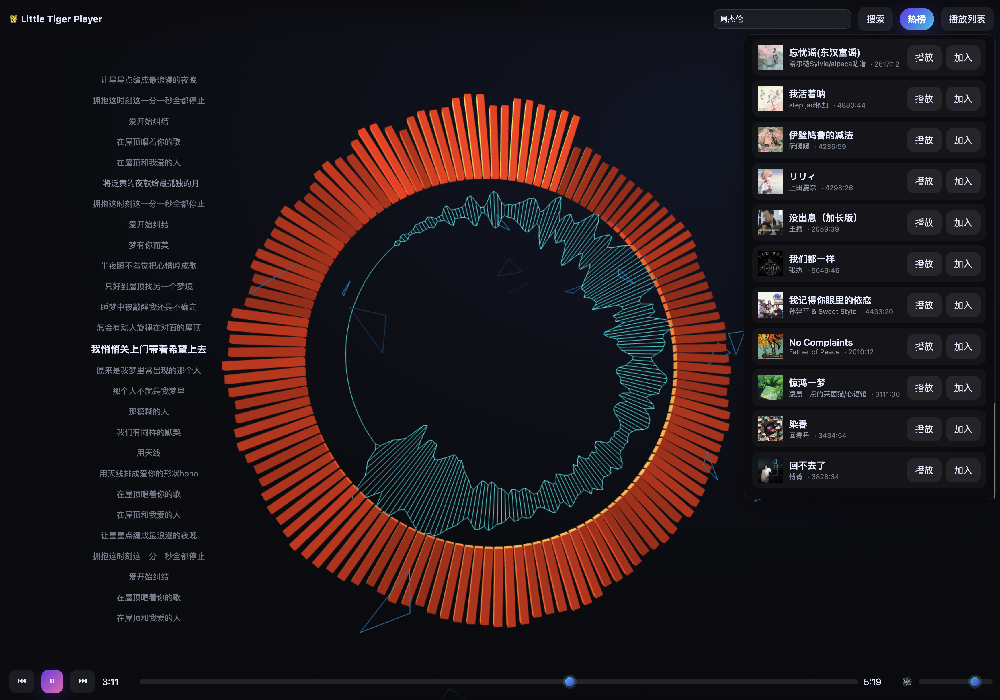

# Super-Player
超炫酷的音乐播放器，自定义音乐风格

## 启动项目
### 1.启动后端服务
- `cd server`
- `pip install -r requirements.txt`

#### 2.启动前端服务
- `cd client`
- `yarn install`
- `yarn run dev`

## 效果预览

- 视频演示

## 历史更新
- 2025-10-14 初始化项目